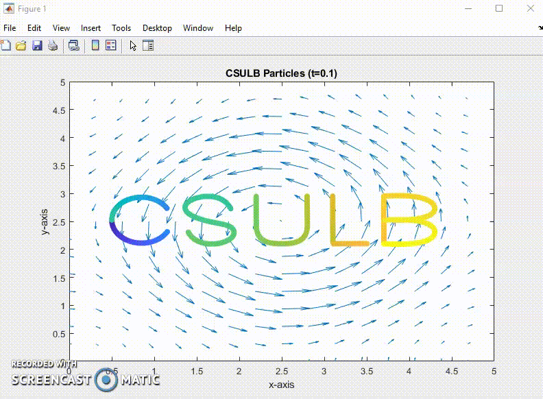

###  About Me 

I'm Vorleak, a recent bootcamp graduate skilled in full-stack development skills and hands-on experience in React, TypeScript, HTML5, JavaScript (ES6), CSS3, Node.js, Express, and PostgreSQL. I've built responsive web applications, handling both front-end and back-end, and designed UI using Figma. 

###  Skills 
- Strong: React, JavaScript (ES6), HTML5, CSS3, TypeScript
- Experienced: Node.js, Python, Express, PostgreSQL, Fetch API, Flexbox, Bootstrap, Tailwind
- Tools: Git, GitHub, Figma, Confluence, JIRA, JAWS, AWS

###  Let's connect!  
- [LinkedIn](https://www.linkedin.com/in/vorleakyek/)
- [Resume](https://drive.google.com/file/d/12rSfAK9-U46XHcTcsmmeclbTAtfKg3lH/view?usp=sharing)
- [My website](https://vorleakyek.github.io/my-portfolio/)
  
###  My Publication
[Numerical investigation on the projection method for the incompressible Navier-Stokes equations on MAC grid.](https://gradmath.org/wp-content/uploads/2020/10/Vorleak-Yek-GJM-2018.pdf)

